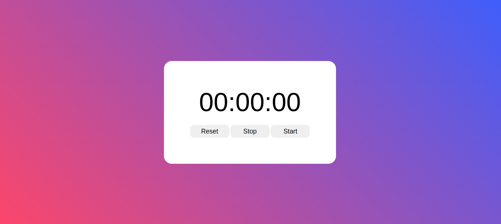

# stopwatch-app

---

### Table of Contents

The sections headers will be used to reference location of destination.

- [Description](#description)
- [How To Use](#how-to-use)
- [References](#references)
- [Author Info](#author-info)

---

## Description

I created a stopwatch using modern syntax. A timer stopwatch using start, stop and reset event listeners on click.

#### Technologies

- HTML
- CSS
- JavaScript

[Back To The Top](#read-me-template)

---

## How To Use

you can check the demo: <a href="https://stoopwatch-app.netlify.app/">Click Here</a>

## References

inspiration: https://dev.to/gspteck/create-a-stopwatch-in-javascript-2mak

[Back To The Top](#read-me-template)

---

## Author Info

- Twitter - [@diagodryson](https://twitter.com/jamesqquick)
- Linkedin - [@diagodryson](https://linkedin.com/in/diagodryson)

[Back To The Top](#read-me-template)